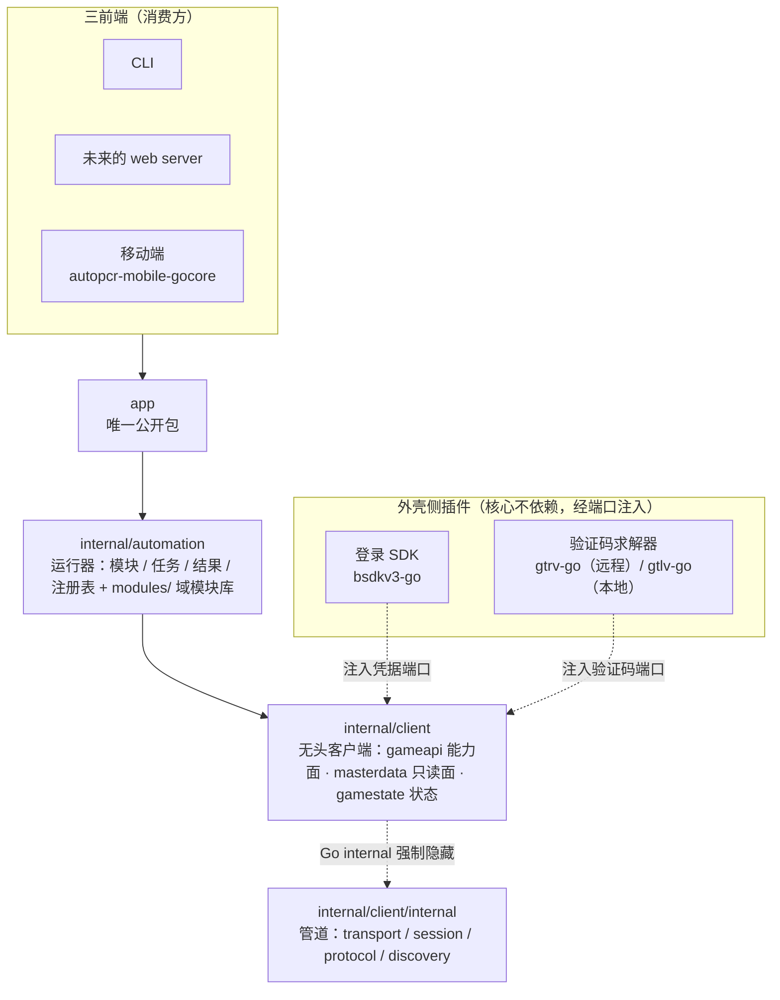

# go-autopcr-core

> 公主连结（PCR）自动清日常的 **Go 重构版**——无头游戏客户端 + 单账号自动化运行器，纯 Go、**零 CGO**、跨平台。


由原 Python 项目 [cc004/autopcr](https://github.com/cc004/autopcr) 移植而来。对外**唯一公开 Go 包是应用服务门面 `app`**——CLI、未来的 web server、以及移动端 wrapper（[autopcr-mobile-gocore](https://github.com/cca2878/autopcr-mobile-gocore)）均依赖它，不导入底层的 `internal/`。

## 特性

- **无头客户端**：登录（AccessKey 直传 / bilibili 账密冷启动）、传输加密（AES-CBC + 兼容 msgpack）、会话维护（**严重错误码自动重登**，如被其他客户端强制下线）、响应折叠为玩家状态。
- **母数据管线**：不依赖 UnityPy 的纯 Go 解包（UnityFS + LZ4）+ rainbow 反混淆 + 在线版本管理与免登录刷新。
- **自动化运行器**：按游戏域分包的模块库（收取 / 查询 / 报告，一律"先查后动"），配置驱动、可单可批、结构化结果；**配置候选可依赖账号与母数据**（登录后据实解析并校验，而非编译期硬编码——如彩装选装、黎明界公会）；支持任务级进度推送与边界取消。
- **应用服务门面 `app`**：地道 Go（context / 结构体 / error）的产品级操作面，供三前端共享。
- **零 CGO**：`CGO_ENABLED=0`，SQLite 采用纯 Go 的 `modernc.org/sqlite`，保证跨平台可移植。

## 架构

**functional core / imperative shell**：确定性的核心（给定账号 + 线上状态 + 配置，`Run` 输出可复现，核心内部用**服务器时间**而非本机 wall clock）与有副作用的外壳（网络 / 登录 / 落盘）分离。



| 层 | 路径 | 职责 |
|----|------|------|
| 应用门面 | `app` | 三前端共享的产品操作面（`Session` / `Run` / `RefreshMasterdata`） |
| 运行器 | `internal/automation` | 模块 / 任务 / 结果 / 注册表框架 + `modules/` 按域分包的模块库 |
| 无头客户端 | `internal/client` | 装配枢纽；`gameapi` 能力面、`masterdata` 只读查询面、`gamestate` 状态 |
| 管道（隐藏） | `internal/client/internal` | transport / session / protocol / discovery（Go internal 规则强制隐藏） |

核心凭据只吃 `(channel, uid, access_key)`；登录 SDK 与验证码求解器均属外壳、经端口注入接入（上图虚线），核心不携带二者实现，故依赖极薄（`codec` / `lz4` / `sqlite`）、便于跨平台移植。

**本仓是纯库，无任何可执行产物**：日志、配置、目录默认值同样是外壳的职责（门面的目录一律由调用方传入，核心不假设工作目录）。开发测试用的 CLI 见 `autopcr-cli`——它作为纯外部消费方存在，因而也是 `app` 门面的检验手段：门面缺失的部分会导致其编译失败。母数据解包已内化进 `internal/client/masterdata`（登录与 `RefreshMasterdata` 共用 `Manager.EnsureDB`，rainbow 随客户端内嵌）。

## 快速开始

需要 Go 1.25+。

```sh
make build              # go build ./...（CGO_ENABLED=0 下全部包可编译）
make test vet lint      # 单元测试 + 静态检查 + golangci-lint
make check-cgo          # 校验 CGO 确实禁用（读测试二进制的内嵌构建设置）
```

## 作为库消费

```sh
go get github.com/cca2878/go-autopcr-core
```

经 `app` 门面：`app.NewSession(dirs, opts...)`（是否接母数据由构造期的 `WithMasterdata()` 选项决定）→ `Login(ctx, channel, uid, accessKey)` → `Run(ctx, tasks, obs)`（`obs` 为可选进度观察者）/ `RefreshMasterdata`。参考消费方见 `autopcr-cli` 仓库。移动端经 gomobile 封装层 [autopcr-mobile-gocore](https://github.com/cca2878/autopcr-mobile-gocore) 出 Android AAR。

## 文档

更详细的开发文档在 [docs/](docs/) 目录：

- [架构总览](docs/architecture.md)——分层、依赖方向、确定性契约、错误体系、日志约定。
- [折叠器：响应到玩家状态](docs/folding.md)——两层折叠架构、Carrier 接口、如何给新响应接入折叠。
- [新增自动化模块](docs/adding-a-module.md)——从协议 DTO 到注册上线的完整步骤。
- [外壳接入指南](docs/shell-integration.md)——在 `app` 门面之上做 CLI / web server / 移动端的公开面详解。
- [编码与文档约定](docs/conventions.md)——硬性约束、包落位规则、提交纪律。

## 许可证与署名

本项目采用 **CC BY-NC-SA 4.0**（署名-非商业性使用-相同方式共享），见 [LICENSE](LICENSE)。

go-autopcr-core 是 [cc004/autopcr](https://github.com/cc004/autopcr)（同为 CC BY-NC-SA 4.0）的 Go 移植作品。使用须保留署名、限非商业用途，衍生作品须以相同方式共享。
