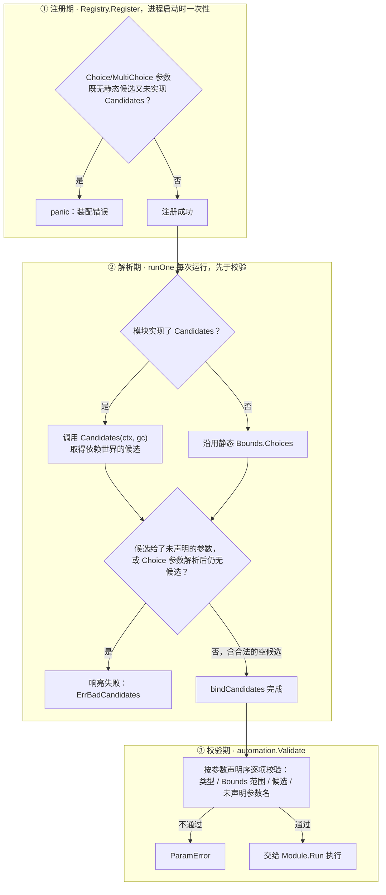

# 新增自动化模块

本文档说明如何为 `internal/automation/modules` 新增一个自动化模块。动手前建议先阅读 [architecture.md](architecture.md) 了解四条按域分包的平行结构与确定性契约；本篇仅说明具体操作步骤。

## 先判断要动哪几层

新模块通常只需要新增"自动化模块"这一层，复用已有的能力面与查询面；只有当游戏功能本身还没有对应的 API 调用或母数据查询时，才需要从下往上补齐。用这张表判断：

| 情况 | 要动的层 |
|---|---|
| 已有能力面方法、已有母数据查询，只是新的判定/编排逻辑 | 只加 `automation/modules/<域>` |
| 游戏功能对应的 API 还没有能力面方法 | 先补 `protocol/<域>`（如缺 DTO）→ `gameapi/<域>` |
| 判定需要查询母数据里还没暴露的表 | 补 `masterdata/<域>` |
| 需要用到玩家状态里还没折叠的字段 | 补 `gamestate/fold` |

以下按从下到上的顺序逐层说明，某层已具备时可跳过该步。示例代码引用黎明界域（`labyrinth`）的真实实现，它是少数完整贯穿全部四层的域之一。

## 1. 协议层：DTO（若已有可跳过）

`internal/client/internal/protocol/<域>` 存放该域的请求/响应结构体。每个类型内嵌 `protocol.RequestBase`/`protocol.ResponseBase`，端点用 `protocol.MustRelURL` 声明：

```go
// internal/client/internal/protocol/labyrinth/labyrinth.go（节选）
var urlTop = protocol.MustRelURL("labyrinth/top")

type TopRequest struct{ protocol.RequestBase }
func (*TopRequest) URL() *url.URL { return urlTop }

type TopResponse struct {
	protocol.ResponseBase
	EnterID                    int                  `msgpack:"enter_id" json:"enter_id"`
	GuildClearedDifficultyList []GuildClearedDifficulty `msgpack:"guild_cleared_difficulty_list" ...`
}
```

**共用模型的落位规则**：一个响应模型只要跨 2 个及以上域包出现，就定义在 `protocol` 根包，不在各域包各写一份——判据不是"现在有几处在用"而是"协议上它是否跨域"。已按此规则拆出的共用文件：`inventory.go`（库存/奖励条目）、`currency.go`（金币/钻石）、`player.go`（体力/等级）、`unit.go`（角色）、`quest.go`（战斗结算）。新增共用模型归入对应文件，均不适用时再新建文件。

## 2. 能力面：`gameapi/<域>`（若已有可跳过）

每个域子包定义一个 `API` 接口 + `Impl` 实现（只持 `*transport.Client`）+ 结果类型，方法内部完成请求体构造、发包、解码：

```go
// internal/client/gameapi/labyrinth/labyrinth.go（节选）
type API interface {
	Top(ctx context.Context) (*TopResult, error)
	Enter(ctx context.Context, guildID, difficulty int) (*EnterResult, error)
	Retire(ctx context.Context, enterID int) error
}

type Impl struct{ tr *transport.Client }
func New(tr *transport.Client) *Impl { return &Impl{tr: tr} }

func (a *Impl) Top(ctx context.Context) (*TopResult, error) {
	resp, err := transport.Call[labyrinthpb.TopResponse](ctx, a.tr, &labyrinthpb.TopRequest{})
	// ... 把 resp 整理成域结果类型 TopResult
}
```

新域需要在 `internal/client/gameapi/gameapi.go` 的 `GameAPI` 接口与 `set` 实现里各加一个访问器方法（`Labyrinth() labyrinth.API`），供调用方经 `gc.Labyrinth()...` 访问。**用访问器而非把方法直接嵌入提升**，是为了规避跨子包同名方法的嵌入冲突。

是否解锁、是否满足前置条件等业务判定**不在这一层**——能力面只负责发包，判定留给上层模块。

## 3. 母数据查询：`masterdata/<域>`（若已有可跳过）

同样是 `API` 接口 + `Impl`，但持有的是 `*mddb.DB`（低层只读 DB 句柄）而非传输句柄：

```go
// internal/client/masterdata/labyrinth/labyrinth.go（节选）
type API interface {
	BossUnitIDsByQuest(ctx context.Context) (map[int][]int, error)
	EnterGuilds(ctx context.Context) ([]Guild, error)
}

type Impl struct{ db *mddb.DB }
func New(db *mddb.DB) *Impl { return &Impl{db: db} }
```

同样需要在 `internal/client/masterdata/query.go` 的 `Reader` 接口与实现里加一个访问器。**每种查询目的在其域子包内唯一实现**，杜绝同一张表在多处各写一份 SQL。

## 4. 玩家状态折叠：`gamestate/fold`（若已有可跳过）

新响应类型如果携带库存变动、货币余额等已定义好的共用模型，直接实现对应的 `Carrier` 接口即可被通用层（`fold/common.go`）自动折叠，不需要写任何折叠代码。只有响应携带域专属的字段（无法用现成 Carrier 表达）时才需要在对应域文件（`fold/account.go`、`fold/daily.go` 等，没有就新建）里手写折叠器，并在 `fold/fold.go` 的 `DefaultRegistry` 里登记。动手前应先确认确有必要——参考项目 78% 的折叠逻辑均由通用层统一处理。完整机制、决策指南与常见陷阱见 [folding.md](folding.md)；⚠️ 写了折叠器忘记登记不会有任何报错，务必对照该文档的测试模式验证。

## 5. 自动化模块本体

在 `internal/automation/modules/<域>` 下定义模块类型（**类型不导出**，小写开头），实现 `Module` 接口：

```go
// internal/automation/modules/labyrinth/labyrinth.go（节选）
type startReroll struct{}

func (startReroll) Meta() automation.Meta {
	return automation.Meta{
		Name:            "labyrinth_start_reroll",
		Title:           "黎明界刷开局",
		Description:     "反复进入黎明界直至刷到满足条件的开局……",
		Category:        "黎明界",
		NeedsMasterdata: true,
	}
}

func (startReroll) Params() []automation.Param { /* 见下节 */ }

func (startReroll) Run(ctx context.Context, gc client.GameClient, rc *automation.RunContext) error {
	// 先查后动：动作前先查状态
}
```

`Meta.Name` 是稳定键（CLI/配置据此引用，不应改动），`Meta.NeedsMasterdata` 声明本模块是否需要母数据只读句柄——上层据此决定是否为这次运行启用 `WithMasterdata`。

**"先查后动"是硬性约束**：模块正常运行绝不应触发游戏业务错误码——动作前先查状态（如领取礼物前先查礼物箱是否有可领取物品），不要靠捕获业务错误来控制流程，也不要把业务码宽大处理成 Skip。前置条件不满足时用 `automation.Skip(format, args...)` 返回一个跳过信号，与真正的失败（返回其它 error）明确区分。

母数据不可用时，用框架提供的 `automation.RequireMasterdata(purpose)` 构造错误并直接返回——这是装配错误（要么调用方没启用母数据、要么母数据构建本身失败了），不是模块的业务判断，不能当成"今天没事可做"静默 Skip。

### 可选扩展一：`Candidates`

当某个 `ParamChoice`/`ParamMultiChoice` 参数的候选值依赖账号或母数据（如"选哪件彩装""进哪个公会"），无法在 `Params()` 里静态给出时，实现 `Candidates` 接口：

```go
func (startReroll) Candidates(ctx context.Context, gc client.GameClient) (map[string][]automation.Option, error) {
	md := gc.Masterdata()
	if md == nil {
		return nil, automation.RequireMasterdata("解析黎明界公会候选")
	}
	guilds, err := md.Labyrinth().EnterGuilds(ctx)
	// ... 转成 map[参数名][]automation.Option{Value, Label}
}
```

**契约**：只读已有的世界（母数据库 + `gc.Data()` 快照），不发新的网络请求——这条界限保证候选解析不给确定性引入新的隐藏输入（见 [architecture.md](architecture.md) 的确定性契约一节）。`Option.Value` 是写回配置的值（如 `guild_id`），`Option.Label` 是给人看的显示名（如公会名）；校验只认 `Value`。

### 可选扩展二：`SessionAware`

当模块需要对"执行到一半会话被强制下线、客户端已自动重登"声明应对策略时，实现 `SessionAware`：

```go
func (m myModule) OnSessionBreak() automation.BreakPolicy { return automation.BreakRestart }
```

三档策略的语义与声明前提见 [architecture.md](architecture.md#会话断点与自动重登)。**不实现即最保守的 `BreakAbort`**，多数模块不需要关心这个接口。

## 6. 注册

在域子包的 `Register(r *automation.Registry)` 函数里登记新模块：

```go
// internal/automation/modules/labyrinth/labyrinth.go
func Register(r *automation.Registry) {
	r.Register(startReroll{})
	r.Register(startRerollV2{})
}
```

新增域时还需要在 `internal/automation/modules/modules.go` 的 `DefaultRegistry()` 里加一行 `<域>.Register(r)`。

⚠️ **注册期契约检查**：若模块声明了某个 `ParamChoice`/`ParamMultiChoice` 参数、既无静态 `Bounds.Choices` 又没实现 `Candidates`，`Registry.Register` 会直接 `panic`——这类参数会静默退回"不约束"，而这正是 `Candidates` 机制要消灭的情况。这个检查在进程启动装配阶段生效，`DefaultRegistry()` 是所有模块测试的必经之路，故 CI 会立即发现。

## 7. 测试

复用 `internal/automation/modules/moduletest` 提供的共享测试助手，形成"两层 fake"模式：

- `moduletest.FakeClient` 内嵌 `client.GameClient`，可覆写 `State`（玩家状态）、`MD`（母数据）、`ServerTimeVal`，以及各域的 API 字段（如 `LabyrinthAPI`）。
- 各域自己实现一个满足该域 `API` 接口的 fake 类型（如 `fakeLab`），注入进 `FakeClient` 的对应字段。
- 用 `moduletest.RunOne(gc, module, values)` 经真实 `Runner` 运行单个任务（覆盖参数校验、候选解析等完整逻辑），断言 `Result` 的确切内容。

```go
gc := &moduletest.FakeClient{
	State:        &gamestate.PlayerState{ClearedQuests: map[int]struct{}{labyrinthUnlockQuest: {}}},
	MD:           fakeMDReader{lab: fakeMDLab{guilds: testGuilds}},
	LabyrinthAPI: &fakeLab{top: &lab.TopResult{...}, enter: &lab.EnterResult{...}},
}
res := moduletest.RunOne(gc, startReroll{}, nil)
```

每个模块的 `_test.go` 应在固定的假世界状态下断言确切输出——这正是"确定性"这条契约的可操作化验证。声明了 `Candidates` 的模块另外用 `automation.CheckCandidates(ctx, gc, module)` 做契约自检：它解析一次参数候选并报告是否自洽，等价于对"这个模块运行时会不会因参数候选而失败"的提前验证。

## 参数系统详解

`Param` 是模块参数的静态定义（随 `Params()` 走，不随每次调用的实际值重复携带）：

```go
type Param struct {
	Name        string
	Type        ParamType
	Default     any
	Description string
	Bounds      Bounds
}
```

五种 `ParamType`：

| 类型 | 值形态 | Bounds 用法 |
|---|---|---|
| `ParamBool` | `bool` | 不用 |
| `ParamInt` | 整数 | `Bounds.Min`/`Max`（含边界，`nil`＝不限） |
| `ParamString` | 字符串 | 一般不约束（受限字符串走 `ParamChoice`） |
| `ParamChoice` | 单选，值为 `string` | `Bounds.Choices` |
| `ParamMultiChoice` | 多选，值为**有序** `[]string`（顺序有意义时即优先级） | `Bounds.Choices` |

一次任务的参数解析要经过三道关卡，按发生时机排列：



- **① 注册期**：这是"装配错误"，不是运行期可恢复的输入错误，故用 `panic` 而非 `error`——也是这条不变量能落到的最早时机，Go 的类型系统本身表达不了"Choice 必有候选"。
- **② 解析期**：两处响亮失败分别对应参数名拼错（候选给了未声明的参数）与候选来源缺失（静态和动态均未提供）。**给了空候选不在此列**——它表示"世界里当前没有可选项"（如新号没有彩装），是合法状态。
- **③ 校验期**：按参数**声明序**而非 map 迭代序进行，保证同一份非法配置每次报错都相同。

`Config`（`RunContext` 内嵌）是单次任务解析后的只读有效值，用 `rc.Bool(name)`/`rc.Int(name)`/`rc.String(name)`/`rc.Strings(name)` 取值，缺失或类型不符时返回该类型的零值。

## 命名与别名约定

各域模块子包在导入同名 `gameapi`/`masterdata` 域包时用别名区分层级，如 `modules/daily` 里 `gapidaily "…/gameapi/daily"`、`mdstory "…/masterdata/story"`；`gameapi` 各域导入同名 `protocol` 域包也用别名，如 `gameapi/daily` 里 `dailypb "…/protocol/daily"`。命名模式是"层级缩写 + 域名"，沿用邻近代码已有的别名风格即可。

## 遥测

模块可通过 `rc.Emit(kind string, fields map[string]any)` 发射结构化观测（核心侧中性载荷，不关心去向——外壳注入的 `Collector` 决定缓冲/持久化/上传）。`kind` 是观测类别（如 `"alces_roll"`），字段键名由各模块自行约定，需要跨模块比对时应与已有 kind 的字段命名风格保持一致。不注入 `Collector` 时 `rc.Emit` 是 no-op，不影响模块业务判定与 `Run` 结果。

## 提交前检查清单

- 新模块的 `_test.go` 在固定假世界状态下断言确切输出。
- 声明了 `Candidates` 的模块已执行 `CheckCandidates` 自检。
- `Meta.NeedsMasterdata` 与实际是否调用 `gc.Masterdata()` 一致。
- 确认"先查后动"：正常路径不触发游戏业务错误码。
- `make test vet lint` 与 `gofmt -l .` 全部通过（见 [conventions.md](conventions.md)）。
