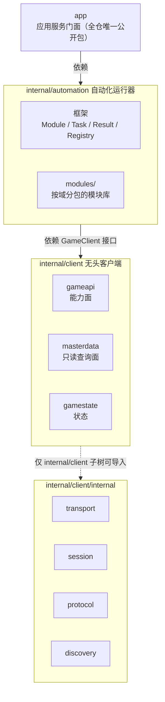
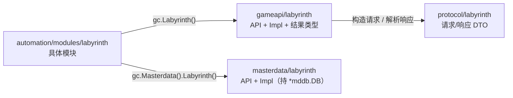
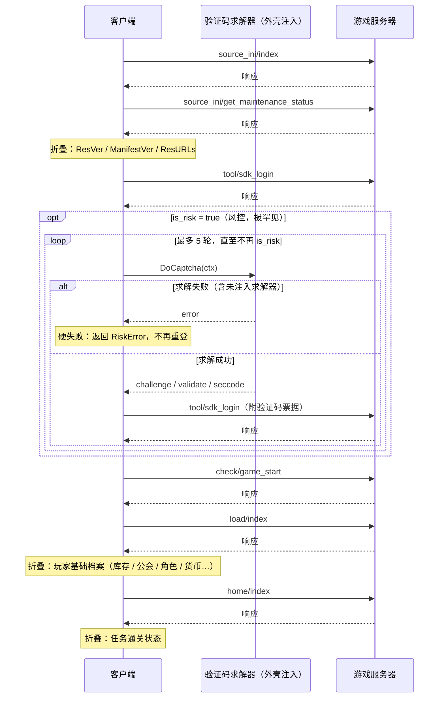
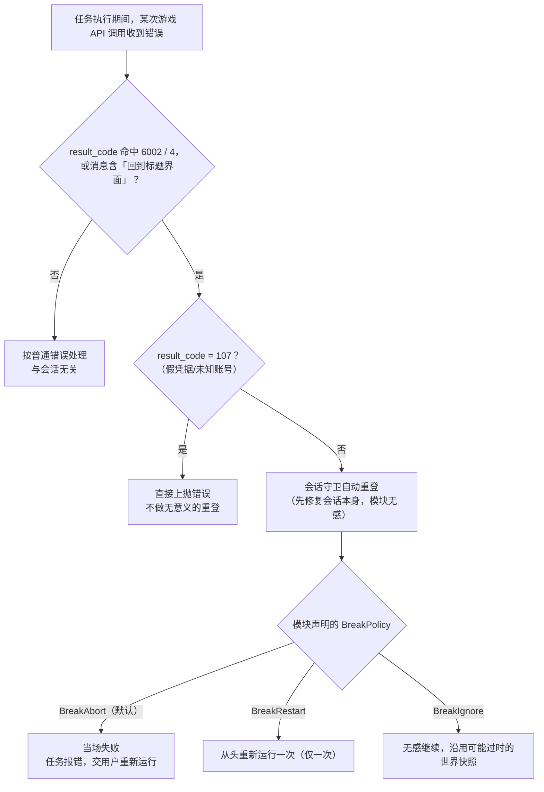

# 架构总览

本文档面向初次接触本仓库、需要了解代码组织方式与分层理由的读者。编码约定见 [conventions.md](conventions.md)；新增自动化模块见 [adding-a-module.md](adding-a-module.md)；在 `app` 门面之上开发前端见 [shell-integration.md](shell-integration.md)。

## 分层与依赖方向

依赖只能自上而下：`app` 依赖 `internal/automation`，后者依赖 `internal/client` 的公共接口 `client.GameClient`，两者均不反向依赖。`internal/client/internal`（虚线框）由 Go 的 internal 规则强制约束——只有 `internal/client` 子树内的包能够导入它，`internal/automation` 与 `app` 均无法访问，故传输协议、加密、会话状态机等实现细节对上层完全不可见。

| 层 | 路径 | 职责 |
|---|---|---|
| 应用门面 | `app` | 三前端共享的产品操作面（`Session` / `Run` / `RefreshMasterdata`） |
| 运行器 | `internal/automation` | 模块 / 任务 / 结果 / 注册表框架 + `modules/` 按域分包的模块库 |
| 无头客户端 | `internal/client` | 装配枢纽：`gameapi` 能力面、`masterdata` 只读查询面、`gamestate` 状态 |
| 管道（隐藏） | `internal/client/internal` | `transport` / `session` / `protocol` / `discovery`（Go internal 规则强制隐藏） |

## 四条按域分包的平行结构

游戏功能按域（账号、每日收取、公会、黎明界……）拆分，同一个域名在四条不同的树上各出现一次：

| 结构 | 路径 | 内容 |
|---|---|---|
| 协议 DTO | `internal/client/internal/protocol/<域>` | 请求/响应结构体，内嵌 `protocol.RequestBase`/`ResponseBase` |
| 游戏 API 能力面 | `internal/client/gameapi/<域>` | 该域的 `API` 接口 + `Impl` 实现 + 结果类型 |
| 母数据只读查询 | `internal/client/masterdata/<域>` | 该域的 `API` 接口 + `Impl` 实现，持 `*mddb.DB` |
| 自动化模块 | `internal/automation/modules/<域>` | 该域的具体模块，`Register(r)` 登记进注册表 |

以黎明界域（`labyrinth`）为例，四条树间的实际调用关系：

模块经能力面访问器发起游戏动作、经母数据访问器做只读判定，两条路径互不相干；只有能力面自己在内部依赖协议层的 DTO——母数据查询直接面向 SQLite，不经过 `protocol`。

每条树的顶层都以**访问器**聚合各域，而不是把方法直接提升到顶层类型上（同名方法在不同子包间会冲突）：`gc.Daily()`、`gc.Masterdata().Labyrinth()` 这类调用先获取域接口，再调用具体方法。新增一个域即在对应的四条树上各建一个子包，域名保持一致（一个已知例外见下）。

⚠️ **`protocol/alces` ↔ `gameapi/exequip` 域名不一致**：`alces` 是"彩装究极炼成"这套玩法在游戏内部的系统名，`exequip` 是"EX 装备"。找彩装相关的 DTO 要去 `protocol/alces`，`protocol/exequip` 并不存在。其余域三层同名。

## 确定性契约

**给定账号、线上状态（含服务器时间）与配置固定，`automation.Run` 的输出可复现。** 这是自动化层最重要的性质，体现在几处具体约束：

- **时间一律取服务器时间。** 模块内不使用 `time.Now()`——凡涉及时间门禁的判定都经 `gc.ServerTime()`。时间被当作服务器下发的数据，而不是本机的隐藏输入。
- **map 迭代序不得泄漏进输出。** 凡需要把 map 的 key 集合转换为有序输出（如遥测载荷、格子编号列表）之处，一律先转换为切片并排序（`sort.Ints`、`slices.Sort`、`slices.Sorted(maps.Keys(...))`）再使用；纯粹的计数或求和类聚合天然与遍历顺序无关，不需要额外处理。
- **`Observer` 与 `Collector` 是纯旁路。** 二者是否注入不影响 `Run` 返回的 `[]Result`——`Event`/`Observation` 按值传递，核心从不回读它们的返回值，故传或不传观察者/采集器，业务结果逐字节相同。
- **`Candidates` 只读已有世界。** 依赖账号或母数据的参数候选（见 [adding-a-module.md](adding-a-module.md) 的参数系统一节）只允许读取已经存在的母数据库和 `gc.Data()` 快照，不得发起新的网络请求——这条界限保证候选解析不会给确定性引入新的隐藏输入。

这条契约的边界停在"写"这一步：模块执行副作用（发起收取、领取、抽取等请求）之后，线上状态已经改变，同一模块同一输入不再产生同一结果——这是有意的，自动化的职责是在给定世界快照下做出确定的判断，而不是让整条流程变成纯函数。

## 会话、玩家状态与折叠

登录是一个固定的六步序列（`session.Login`，步骤以 `session_test.go` 的 `TestLoginSequence` 钉住）：

风控分支只在 `tool/sdk_login` 判定 `is_risk` 为真时触发（外壳未注入求解器时，第一次 `DoCaptcha` 就会失败并硬失败退出，不会真的发出重登请求）。

每一步的响应都经折叠中间件（`internal/client/gamestate/fold`）落进 `gamestate.PlayerState`，供后续模块通过 `gc.Data()` 读取；上图的 `Note` 只标出了目前有明确字段消费的三步，其余步骤同样过一遍折叠中间件，只是暂无对应字段。折叠逻辑按"是否认响应类型"分两层：

- **通用层**（`fold/common.go`）不关心具体是哪个响应，只看它实现了哪些 `Carrier` 接口（如 `RewardCarrier` 代表"这个响应带库存变动"）。参考项目里 138 个折叠 handler 有 108 个（78%）没有任何域专属逻辑，均由这一层统一处理。
- **域专属层**（`fold/account.go`、`fold/daily.go`、`fold/clan.go`、`fold/race.go`、`fold/alces.go`、`fold/discovery.go`）处理剩下 22% 真正需要手写的逻辑，按域分文件。

`gamestate` 包本身是纯数据层：不依赖 `transport` 或网络，可用 mock 独立测试。折叠面单独放在 `gamestate/fold` 子包而不是 `gamestate` 内部，是为了让依赖方向保持单向——折叠器需要引用 `gamestate.PlayerState`，若默认注册表也放在 `gamestate` 包里，两边就得互相导入。

折叠的自动接线方式、四个 Carrier 接口、如何给新响应接入折叠、常见的取值陷阱，见 [folding.md](folding.md)。

## 会话断点与自动重登

游戏服务器在若干"严重"错误下会主动丢弃会话（被其他客户端强制下线、服务端判定客户端数据不一致等），此时客户端必须重新执行登录序列才能继续。这类失效与模块逻辑无关，由传输层的会话守卫自动处理，不冒泡成模块失败——除非模块自己声明需要感知它。

**严重错误码的判据**（`internal/client/relogin.go`）：`result_code` 命中 `6002`（被强制下线）或 `4`（会话丢失）即判定为需要重登；未知错误码则退而用消息文本里是否含"回到标题界面"这个特征串兜底（必要非充分条件）。有一个显式豁免：`result_code=107`（假凭据/未知账号）虽然消息同样含这个特征串，但用同一个 access_key 重登必然再次失败，故照常把错误上抛，不做无意义的重登。

从判定到模块最终收到什么样的结果，是一条完整的决策链：

**关键点是 E 到 F 这一步分两层**：会话本身的修复（重登）与模块对"这次执行是否可信"的表态是两件事——前者总会发生，后者才是模块可选声明的部分。模块通过实现可选接口 `SessionAware.OnSessionBreak()` 声明自己在 F 处走哪条分支，不实现即最保守的 `BreakAbort`：

| 策略 | 语义 | 声明前提 |
|---|---|---|
| `BreakAbort`（默认） | 断点处当场失败，任务报错、交用户重新运行 | 无——任何模块不声明即此档 |
| `BreakRestart` | 断点后自动从头重新运行一次 | 重新运行一次**不会重复扣资源**（"先查后动"铁律天然满足这条：收取类模块重新运行时会先查、发现已领完即无操作） |
| `BreakIgnore` | 断点无所谓，会话错误照常自愈重发，模块无感 | 模块**完全不写入**（纯查询/报告） |

`BreakRestart` 会让断点前已经 `rc.Emit` 过的观测再发一次（遥测按次计），声明前需一并考虑这一点。

## 错误体系：Domain × Kind

全仓错误按两个维度归类（`internal/errs`），二者缺一个都不足以决定处置方式：

- **Domain**（哪一部分出的问题）：`DomainGameAPI`（游戏服务器交互）、`DomainMasterdata`（母数据链）、`DomainCredential`（凭据）、`DomainAutomation`（自动化）、`DomainApp`（门面装配），未自报来源则为 `DomainUnknown`。
- **Kind**（该怎么办）：`KindTransient`（这次不行下次可能行，可重试）、`KindRejected`（对端明确回绝，不应重试）、`KindCorrupt`（数据形状不对，丢掉重取）、`KindMisuse`（调用方给错了，让用户改或外壳自己修正）、`KindInternal`（我们的缺陷）、`KindUnsupported`（已知边界，本实现没覆盖）、`KindEnvironment`（本地磁盘/权限问题），未分类则为 `KindUnknown`。

两维缺一不可的原因：同样是 `KindCorrupt`，来自 `DomainGameAPI` 多半是客户端版本对不上（该提示更新），来自 `DomainMasterdata` 则是资源包下载损坏（清掉重下即可）——处置完全相反，单看 Kind 分不出来；单看 Domain 又不知道能不能重试。

`errs.Classify(err)` 沿错误链取**最外层**自报的归类——包装错误的那一层，往往正是对"这个失败该怎么处理"做过判断的那一层（如传输层把解码失败包进 `NetworkError` 时，明知里面是协议错误，仍决定按可重试对待）。各域自己的具体错误类型（`gameerr.APIError`、`gameerr.RiskError` 等）回答更细的问题（哪个参数、哪个 result_code），`errors.As` 到具体类型是比 Domain × Kind 更深入一层的手段，不是替代关系。

门面 `app` 只提升外壳"获取后确实能做出不同动作"的那部分：`ErrorClass`/`ClassifyError` 这套两维定位一定提升，因为一个 switch 就能覆盖所有错误；具体类型只提升 `APIError`、`PanicError`、`RiskError`、`SessionBreakError` 四个，其余"类型不同但处置相同"的（如网络错误与协议错误）不提升——公开面越小越好维护。

## 日志：谁知道后果，谁记 Error

日志级别约定的核心原则：**同一层看到的同一种错误，可能是即将自愈的正常波动，也可能是确实发生了故障；只有知道最终能否自愈的那一层，才有资格判断这条日志应记录为何种级别。**

具体到传输层与会话守卫：传输层收到业务错误码时不知道后果——它可能是会话失效码（随即被会话守卫自愈）、也可能是模块的正常业务判断（最终变成任务结果里的 `Err` 交给调用方处理）。两种情况若都记 Error，一次成功的自愈也会在日志里留下一条误导性的错误记录。故传输层的业务错误一律 **Warn**，唯独 `result_code=203`（确定不可恢复）记 **Error**；会话守卫重登失败记 **Error**（这一层确实知道后果：会话无法恢复，后续请求全部失效），重登成功记 Info，"按策略中止本次调用"记 Warn。这条约定有单测钉住（`transport/logging_test.go` 的 `TestBusinessErrorLogsWarnNotError` 与 `TestUnrecoverableBusinessErrorLogsError`），一旦被改成"业务错误一律 Error"，对应用例便会失败。

`internal/automation` 和 `app` 两层**有意不持有 logger**：`automation` 是前面所说的确定性核心，进度信息走 `Observer` 事件、结论走 `Result.Log`/`Result.Err`，不做 IO；`app` 只做装配转发。模块若需要记录诊断信息，只能通过 `rc.Logf`——这会写入面向用户的过程日志，而非独立于结果之外的诊断通道。

## 零 CGO 与依赖面

全仓 `CGO_ENABLED=0`，SQLite 用纯 Go 实现的 `modernc.org/sqlite`、UnityFS 解包用纯 Go 的 LZ4，跨平台可移植是硬性约束（`Makefile` 的 `check-cgo` 目标会编译一个测试二进制并读取其内嵌构建设置来验证这一点）。

核心的外部依赖因此收窄到 `{codec（msgpack）, lz4, sqlite}` 三个。这个薄依赖面不是自然结果，而是两条有意的架构边界带来的：

- **登录 SDK 不在核心里。** 核心的凭据端口（`internal/client/credential`）只吃 `(channel, uid, access_key)` 四要素；账密→access_key 的冷启动（如 bilibili 账密登录）是外壳职责，核心不依赖任何登录 SDK（如 bsdkv3-go）。
- **验证码求解器不在核心里。** `internal/client/credential/captcha` 只定义求解端口，不带任何实现；核心不携带、不依赖任何远程或本地求解库。外壳经 `app.WithCaptchaSolver` 注入具体实现；不注入时，触发风控(is_risk)的登录会以 `captcha.ErrNoSolver` 硬失败——响亮、可诊断，而不是静默放行或用占位实现。

这两个部件都行为不明或有副作用（网络请求、本地推理），与"确定性核心"的定位天然冲突，故经端口注入，由外壳（imperative shell）负责装配。本仓因此是**纯库、无任何可执行产物**：日志、配置、目录默认值同样是外壳的职责——门面的目录（`app.Dirs`）一律由调用方显式传入，核心不假设工作目录。

## 术语表

| 术语 | 含义 |
|---|---|
| 参考项目 | 本项目移植自的原 Python 实现，工作区内以 `ref/` 目录存在（不属于本仓，仅用于交叉核对） |
| 母数据 | 游戏客户端内嵌的静态数据库（角色/关卡/物品等配置），CN 版经哈希混淆，需反混淆后使用 |
| 折叠 | 把游戏服务器响应中的数据整理进 `gamestate.PlayerState` 的过程 |
| 能力面 | 对上层暴露的一组按域组织的方法集合，如 `gameapi`（游戏 API 能力面）、`masterdata`（母数据只读查询面） |
| 外壳 | functional core / imperative shell 中的 imperative shell：承担登录冷启动、验证码求解、目录、日志等有副作用或平台相关的职责，与本仓的"确定性核心"相对 |
| gt | 本项目使用的验证码服务代称 |
