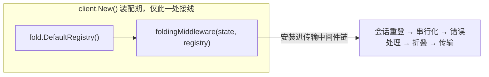
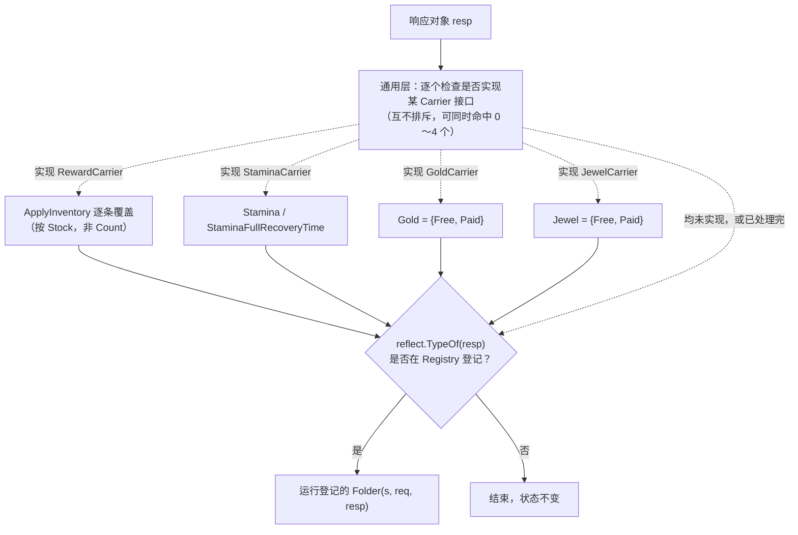
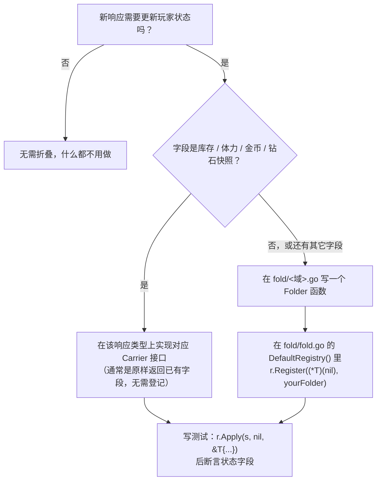

# 折叠器：响应到玩家状态

本文档详解 `internal/client/gamestate` 与 `internal/client/gamestate/fold` 如何把游戏服务器响应整理进 `gamestate.PlayerState`。这部分机制层次不深，但两层分工、自动接线、若干真机验证过的取值细节容易混在一起，单独成篇说明。先读 [architecture.md](architecture.md#会话玩家状态与折叠) 了解它在整体架构里的位置，本篇是该节的展开。

## 一句话概览

**折叠是全自动的**：`internal/client/gameclient.go` 在装配无头客户端时把折叠注册表接进传输中间件链，此后每一次成功的游戏 API 调用都会自动把响应折叠进玩家状态——业务代码（`gameapi` 能力面、`automation` 模块）不需要、也不应该手动调用任何折叠逻辑。真正需要开发者动手的，只是"如何让一个新响应类型被正确折叠"这一件事，本文档主要说明这个。



`foldingMiddleware` 的实现只有几行：请求成功（`err == nil && out != nil`）就调用 `registry.Apply(s, req, out)`，别无分支。全仓只有这一处调用点。

## 两层架构与分发流程

折叠面分两层，按"是否认识具体响应类型"区分：

- **通用层**（`fold/common.go`）：不关心响应是哪个具体类型，只用类型断言检查它实现了哪些 **Carrier 接口**。一个响应可以同时实现 0 到 4 个 Carrier 接口，彼此独立、互不排斥。
- **域专属层**（`fold/<域>.go`）：按响应的**具体类型**在 `gamestate.Registry` 里登记一个 `Folder` 函数，只对登记过的类型生效。

两层在同一次 `Apply` 调用里都会执行，且**先通用层、后域专属层**——域专属折叠器可以在通用层写完之后接着补充或覆盖，两层不会互相清空对方的结果（同一个响应对象常常需要两层都出手，比如公会点赞响应既带体力快照走通用层，又要靠域专属层记"今日已点赞"）。



参考项目原有 138 个折叠 handler，其中 108 个（78%）没有任何域专属逻辑，通篇就是把奖励列表灌进库存、把货币快照抄进状态——全部由通用层这一层统一处理；真正需要手写的只有剩下 22%。这也是通用层值得单独存在、而不是把折叠逻辑按域分文件平铺的原因。

## 通用层：四个 Carrier 接口

Carrier 是一组各自独立的单方法接口，定义在 `internal/client/internal/protocol` 基包（与具体 DTO 分开，因为同一形状会挂在几十上百个不同响应下）：

| 接口 | 方法 | 折叠去向 |
|---|---|---|
| `RewardCarrier` | `InventoryChanges() []InventoryInfo` | 逐条调用 `PlayerState.ApplyInventory`：按 `(Type, ID)` 分流进 `Gold`/`Jewel`/`Inventory` |
| `StaminaCarrier` | `StaminaSnapshot() *UserStaminaInfo` | `Stamina`、`StaminaFullRecoveryTime` |
| `GoldCarrier` | `GoldSnapshot() *UserGold` | `Gold = Currency{Free, Paid}` |
| `JewelCarrier` | `JewelSnapshot() *UserJewel` | `Jewel = Currency{Free, Paid}` |

拆成四个单方法接口而非合并成一个大接口，是因为多数响应只携带其中一两种数据——合并会逼着每个不携带某数据的响应都写一个恒返回 `nil` 的空方法。

**实现一个 Carrier 通常只是把已有字段原样返回**，成本很低。以家园收取响应为例：

```go
// internal/client/internal/protocol/room/room.go
type RoomReceiveItemAllResponse struct {
	StaminaInfo *protocol.UserStaminaInfo `msgpack:"stamina_info" json:"stamina_info"`
	protocol.ResponseBase
	RewardList []protocol.InventoryInfo `msgpack:"reward_list" json:"reward_list"`
}

func (r *RoomReceiveItemAllResponse) InventoryChanges() []protocol.InventoryInfo {
	return r.RewardList
}

func (r *RoomReceiveItemAllResponse) StaminaSnapshot() *protocol.UserStaminaInfo {
	return r.StaminaInfo
}
```

这个响应类型**没有在任何地方登记**（不在 `fold.go` 的 `DefaultRegistry()` 里出现），仅凭实现了两个接口就会被自动折叠——这是通用层存在的意义：新增一个只携带库存/体力/货币快照的响应，只需要在 DTO 文件里补两个方法，`fold` 包完全不用碰。

### ⚠️ `InventoryInfo` 的三个数量字段不可混用

这是通用层里最容易出错、也是唯一经过真机数据反复验证过的一点：

```go
type InventoryInfo struct {
	Type, ID int
	Stock    int // 变动后的余额（服务端账面快照）
	Count    int // 本次变动量（增量）
	Received int // 本次实得量
}
```

**折叠只认 `Stock`**：真机样本里，一次领取若涉及同一 `(Type, ID)` 的多条奖励，`Stock` 在每一条上都是**结算完成后的最终余额**（相同），而 `Count`/`Received` 逐条不同。若按 `Count` 累加而非按 `Stock` 覆盖，库存会直接翻倍。`PlayerState.ApplyInventory` 已经按这条规则实现，**新写的 Carrier 不需要也不应该自己再做汇总**——把 `[]InventoryInfo` 原样交出去即可，覆盖逻辑统一在 `ApplyInventory` 里。

**已知的唯一例外**：`seasonpass.MissionAcceptResponse` 的 `InventoryChanges()` 逆序返回列表（照搬参考项目 `rewards[::-1]` 的写法）——一次女神祭结算横跨多个等级，若 `Stock` 是逐级累进的中间值，正序遍历会让最旧的一条覆盖到最后。参考项目 138 个折叠 handler 里这是唯一一处逆序，说明是该端点的真实特性而非笔误：

```go
func (r *MissionAcceptResponse) InventoryChanges() []protocol.InventoryInfo {
	out := slices.Clone(r.Rewards)
	slices.Reverse(out)
	return out
}
```

新响应默认按服务端下发的原始顺序返回即可，只有明确证据（真机样本或参考项目对应 handler）支持时才逆序。

### ⚠️ 货币的 Free/Paid 是互斥两段，不是总量与其子集

`Currency{Free, Paid}`（以及协议层的 `UserGold`/`UserJewel`）表示的是服务端分开记账的**两个互斥部分**，`Total()` 是两者之和，不是"总量，其中 Free 是里面一部分"。这个误读曾经真实发生过一次：本地字段一度把付费部分当总量展示给用户。写新的 Carrier 实现或读取 `Gold`/`Jewel` 时，注意 `Free` 与 `Paid` 分别对应服务端的哪个字段（`gold_id_free`/`gold_id_pay`，`free_jewel`/`jewel`），不要假设其中一个已经包含另一个。

## 域专属层：何时需要、怎么写

以下情形通用层的 Carrier 接口无法覆盖，需要在 `fold/<域>.go` 写一个 `Folder` 并登记：

- **字段是"裸类型"，没有共用模型可依附**——如 `team_level` 是个裸 `int`，不像库存/货币那样有跨域复用的结构体，硬塞进某个 Carrier 接口没有意义。
- **响应本身不带明确的状态字段，折的是"动作已发生"这个事实**——如公会点赞成功后，服务端只回一个空响应，`ClanLikeCount` 靠"收到了这个成功响应"本身推断为 1，而不是读某个字段。
- **需要清空/重置状态**——如赛马抽取成功后，`CharaFortune` 应置 `nil`（今日已用掉这次机会）。
- **两个权威全量登录响应**——`load/index`、`home/index` 把玩家状态的大部分字段一次性铺满，字段又多又杂，天然属于域专属层。

### 写一个 Folder

`Folder` 签名固定：

```go
type Folder func(s *PlayerState, req protocol.Request, resp any)
```

`req` 参数目前被**全部**现有折叠器忽略（`_ protocol.Request`），但它确实从中间件一路传到这里，并有专门的单测（`TestFoldingMiddlewarePassesRequest`）锁住这条链路——因为将来会出现只有请求携带了"改的是哪条状态"这个信息、响应本身不回传的端点（参考项目里 `story/viewing` 这类）。写新折叠器时若响应本身够用，正常忽略 `req` 即可，不必现在就找它的用途。

典型例子——公会点赞（响应不带任何状态字段，只靠成功这件事本身）：

```go
// internal/client/gamestate/fold/clan.go
func clanLike(s *gamestate.PlayerState, _ protocol.Request, _ any) {
	s.ClanLikeCount = 1
}
```

**响应字段缺席时要用 `if` 守卫，不能无条件赋值**——服务端本轮不下发某字段时，Go 会把它解成零值，无条件赋值会把已有的合法数据抹成 0：

```go
// internal/client/gamestate/fold/daily.go
func missionAccept(s *gamestate.PlayerState, _ protocol.Request, resp any) {
	if r := resp.(*daily.MissionAcceptResponse); r.TeamLevel > 0 {
		s.TeamLevel = r.TeamLevel
	}
}
```

### 登记

写好的 `Folder` **必须**在 `fold/fold.go` 的 `DefaultRegistry()` 里手动登记，否则永远不会被调用：

```go
func DefaultRegistry() *gamestate.Registry {
	r := gamestate.NewRegistry()
	r.UseCommon(common)
	r.Register((*account.LoadIndexResponse)(nil), loadIndex)
	// ……
	r.Register((*clan.ClanLikeResponse)(nil), clanLike)
	return r
}
```

`Register` 的第一个参数传该响应类型的 `(*T)(nil)`，只用来取 `reflect.TypeOf`，本身不会被解引用。

> ⚠️ **忘记登记不会报错。** `Registry.Apply` 对未登记的类型直接跳过（`TestApplyIgnoresUnregistered` 钉住了这一行为：未登记类型既不 panic 也不改动状态）——这是有意的设计（不是每个响应都需要折叠），但代价是**写了 `Folder` 函数却忘记登记这一步，不会有任何编译错误或运行时报错提醒你**，只会表现为状态未按预期更新、且原因不明显。这与 `automation.Registry.Register` 对声明不全的 `Candidates` 参数会直接 `panic` 的强约束不同——折叠这边没有等价的保护，新增域专属折叠器后务必用下面的测试模式验证。

## 决策指南



同一个响应类型可以同时落在两条分支上——既实现某个 Carrier 接口（走通用层），又因为还有别的字段需要一个 `Folder`（走域专属层），二者互不冲突（见上文"两层架构"）。

## 与 Reset 的关系

`PlayerState.Reset()` 在每次登录序列开始前调用（首次 `Login` 与会话失效后的自动重登都会走到），把整个结构体原地清零。这与折叠机制直接相关：折叠器写入的字段如果只在**服务端本轮确实下发**时才更新（前面提到的 `if` 守卫模式），退会等场景下服务端不再下发对应字段，若不清零，旧值会一直留在状态里冒充"当前值"。域专属折叠器里任何用 `if` 守卫的赋值，都要意识到这条依赖——它依赖的正是"登录序列是权威全量源，不清零就可能读到跨会话的陈旧值"这个前提。

## 测试模式

折叠逻辑的测试统一走 `gamestate.Registry.Apply`，不需要真实网络或客户端：

```go
r := fold.DefaultRegistry()
s := gamestate.New()
r.Apply(s, nil, &room.RoomReceiveItemAllResponse{
	RewardList: []protocol.InventoryInfo{
		{Type: 2, ID: 23001, Stock: 275737, Count: 28, Received: 28},
	},
})
if got := s.GetInventory(2, 23001); got != 275737 {
	t.Fatalf("库存=%d want 275737", got)
}
```

`req` 参数在多数用例里直接传 `nil`（现有折叠器都不读它）。完整的测试用例见 `internal/client/gamestate/fold/fold_test.go`，覆盖了本文档提到的全部要点：未登记类型的静默跳过、Stock 覆盖而非 Count 累加、seasonpass 的逆序、通用层与域专属层同时命中同一响应、`if` 守卫下字段缺席不清空已有值、`Reset` 前后的状态对比。新增折叠逻辑时可以参照其中最接近的用例起步。
