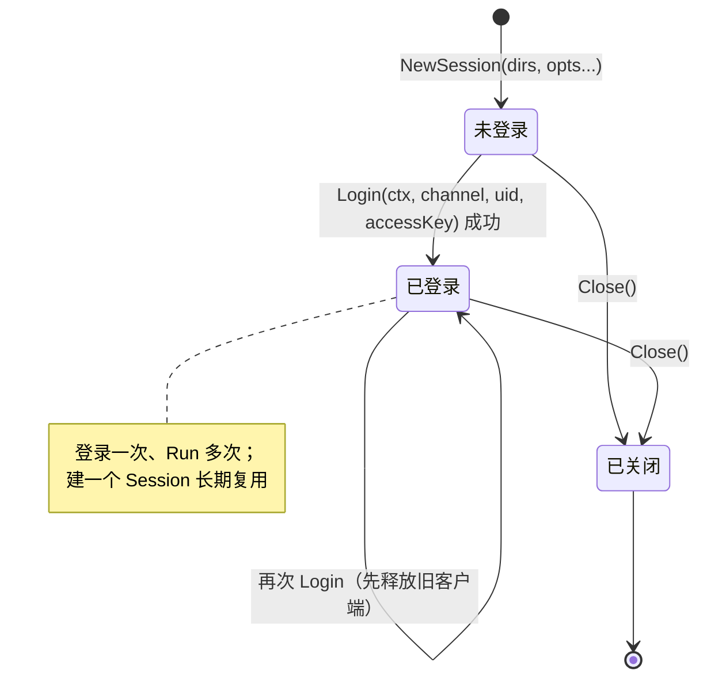
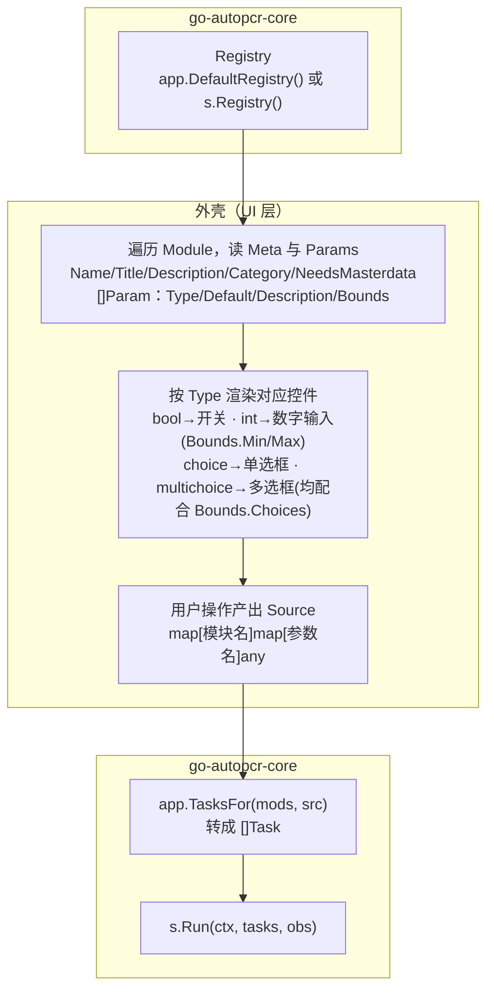

# 外壳接入指南

本文档详解在 `app` 门面之上开发前端（CLI、web server、移动端）所需的公开面。建议先阅读 [architecture.md](architecture.md) 了解核心的分层理由与外壳需要承担的职责，本篇聚焦具体调用方式。

`app` 是全仓唯一公开包，所有前端只依赖它，不导入任何 `internal/` 包。参考消费方见工作区内的 `autopcr-cli` 仓库（本地开发测试外壳，未发布，专用于验证当前工作树的核心）；移动端经 gomobile 封装层 `autopcr-mobile-gocore` 出 Android AAR。

## Session 生命周期

```go
dirs := app.Dirs{Cache: cacheDir}
s := app.NewSession(dirs, app.WithLogger(logger), app.WithMasterdata())
defer s.Close()

if err := s.Login(ctx, app.ChannelBSDK, uid, accessKey); err != nil { ... }

results, err := s.Run(ctx, tasks, obs)
```



`Session` 持有装配好的无头客户端（会话、玩家态、母数据句柄），**有状态、非并发安全**。生命周期归调用方：建一个 `Session` 长期复用，避免每次操作重建（登录 + 母数据 ensure 是昂贵的一次性成本）。多账号场景应各持一个独立的 `Session`。

- **`app.Dirs`**：核心不假设任何工作目录，目前只需要 `Cache` 字段（母数据 SQLite 按版本缓存的落盘位置）。桌面传本地路径，安卓传 `filesDir`/`cacheDir` 等应用私有目录。
- **`app.NewSession(dirs, opts...)`**：构造期用一组 `Option` 定制：`WithLogger`（默认 `slog.Default()`）、`WithProxy`（调试抓包）、`WithInsecureTLS`（跳过证书校验，仅调试用）、`WithCaptchaSolver`、`WithCollector`、`WithMasterdata()`。
- **`WithMasterdata()`** 决定 `Login` 成功后是否按下发的 `res`/`manifest_ver` 确保干净母数据库并打开只读查询面。这是构造期选项而非 `Login` 的参数——是否需要母数据在建 `Session` 时通常已经知道（如按选中模块的 `Meta.NeedsMasterdata` 判定），不必每次 `Login` 都重复传一遍这个跟凭据无关的开关。不声明则 `Login` 不接母数据，`s.Masterdata()` 恒为 `nil`。
- **`s.Login(ctx, channel, uid, accessKey)`**：`channel` 取 `app.ChannelBSDK`（官服）或 `app.ChannelQSDK`（渠道服）。账密→`(uid, accessKey)` 的冷启动**不在这里**，是外壳职责（见下节）。重复调用 `Login`（换号/凭据轮换）会先释放上一个客户端。
- **`s.Player()`** / **`s.Masterdata()`** / **`s.ServerTime()`**：登录后读取聚合玩家状态、母数据只读面、最近同步的服务器时间（Unix 秒）；未登录时分别返回 `nil`/`nil`/`0`。
- **`s.Run(ctx, tasks, obs)`**：必须先 `Login` 成功。单任务传长度 1 的 `[]Task`，批处理传多元素，统一走同一路径；单个任务失败/跳过不影响其余任务继续执行。
- **`s.Close()`**：释放会话资源（母数据库连接）。未登录时安全返回 `nil`。

`app.DefaultRegistry()` 是包级函数，**无需 `Session`** 即可列出/挑选内置模块与预设（如实现"--list"这类命令）；`Session` 内部的 `Registry()` 方法暴露的是同一份注册表，`Run` 按名解析任务时用的正是它。

`app.RefreshMasterdata(ctx, dirs, channel, logger)` 是**免登录/免凭证**路径：自行握手取最新版本、必要时下载反混淆落库，返回一个调用方负责 `Close` 的只读句柄（`app.MasterdataHandle`）。适用于不需要账号、仅需获取最新母数据以供查询的场景。

## 类型别名与常量转发

`app` 把大量 `internal/automation`、`internal/client/*` 里的类型和常量以别名/转发常量的形式提升到自己的公开面（见 `app/types.go`）。这不是随意的便利导出，而是必须的：

- **`ParamType` 与其取值常量（`ParamBool`/`ParamInt`/…）必须一起导出。** 只导出 `Param` 结构体而不导出 `Type` 字段的类型与取值，外部就无法对参数类型做分支——数据驱动表单（按参数类型渲染对应控件）是门面消费方最典型的用法，这条不能省。
- **`CaptchaResult` 必须与 `Solver` 一起导出。** `Solver` 接口的方法签名引用了 `CaptchaResult`；只导出接口而不导出其结果类型，外部实现方将无法实现满足这个接口的类型。命名没有跟着 `captcha.Result` 走，是因为 `Result` 在门面里已经归"任务运行结果"所有，求解结果显式冠以 `Captcha` 前缀以避免混淆。
- **错误的公开面**（`ErrorClass`/`ErrorDomain`/`ErrorKind`/`ClassifyError` 及少数具体类型）按同一条线取舍：外壳获取后确实能做出不同动作的才提升，见下面"错误处置"一节。

需要外壳知道的完整别名/常量清单用 `go doc ./app` 现查最准确（门面演进会持续增补字段，文档不重复维护这份清单）。

## 数据驱动 UI 的标准路径



⚠️ **`Candidates` 的运行时语义**：依赖世界（账号/母数据）的参数，其 `Bounds.Choices` 要到**登录后**才被真正解析填入——`Params()` 返回的静态定义里这类参数的 `Bounds.Choices` 可能是空的。外壳**不能**在登录前把参数表缓存下来当作最终形态使用；要展示这类参数的候选列表（如"选哪件彩装""进哪个公会"），必须在登录成功后重新获取一份解析过的参数定义，而不是复用 `DefaultRegistry()` 在无会话状态下给出的那份静态声明。这正是移动端 `autopcr-mobile-gocore` 里 `toParamDTO` 尚未处理好的一处已知缺口：当前实现直接序列化 `Module.Params()` 的静态声明，未经过 `Candidates` 解析，依赖世界的参数候选在移动端界面上目前看不到。

## Observer 与 Collector 契约

两者都是外壳注入、核心同步调用的只写端口，契约相同：

- **回调必须尽快返回、不得阻塞**——它在 `Run` 所在的 goroutine 上同步调用，慢/阻塞会拖慢整条任务链；耗时处理（落盘、网络上传）请自行转交其它线程。
- **不得 panic**——这是旁路机制，panic 会波及 `Run` 本身；跨 FFI 场景（如 gomobile）需要在封装层捕获异常。
- **事件顺序确定，到达时刻不确定**：`Observer` 按 `Started(i)→Finished(i)` 依次推送，不要让任何逻辑依赖具体的到达时刻。

`Observer` 与 `Collector` 是否注入不影响 `Run` 返回的业务结果——`Event`/`Observation` 按值传递，核心从不回读，故传或不传，`[]Result` 逐字节相同。

## 取消语义

`s.Run` 返回的 `error` 非 `nil` 表示**被取消**（`ctx` 取消或超时），此时返回的 `[]Result` 只含已完成的部分任务。`error` 为 `nil` 表示全部任务已执行完毕（不代表全部成功——单个任务的失败体现在其 `Result.Status == StatusError`）。

`Result.Status == StatusError` **永远只表示真实业务失败**，不含取消的假象；反过来，与取消擦肩而过的真实失败也仍按失败记录，不会被 `ctx` 的当下状态吞掉。两者的区分在错误链上判定（是否确实是 `context.Canceled`/`context.DeadlineExceeded`），而不是看 `ctx` 此刻的状态。

## 错误处置

`app.ClassifyError(err)` 是外壳处理错误的默认入口，返回 `ErrorClass{Domain, Kind}`：

```go
switch cls := app.ClassifyError(err); {
case cls.Kind == app.ErrorTransient:
	// 重试或换个来源
case cls.Kind == app.ErrorRejected:
	// 把理由呈现给用户，不要重试
case cls.Domain == app.ErrorFromMasterdata && cls.Kind == app.ErrorCorrupt:
	// 母数据坏了：清缓存重下
case cls.Domain == app.ErrorFromGameAPI && cls.Kind == app.ErrorCorrupt:
	// 响应解不开：多半客户端版本对不上，提示更新
}
```

Domain × Kind 的完整取值与判据见 [architecture.md](architecture.md#错误体系domain--kind)。需要更细节的信息（如具体 `result_code`）时，`errors.As` 到门面提升的具体类型：`app.APIError`（游戏服务器业务错误）、`app.PanicError`（应中止整条流程的致命态，常见于服务器维护中）、`app.RiskError`（触发风控且未能解除）、`app.SessionBreakError`（任务执行期间会话失效、结果不可信）。

三个哨兵可用 `errors.Is` 精确命中：`app.ErrNotLoggedIn`（会话未登录）、`app.ErrNoSolver`（触发风控但未注入验证码求解器）、`app.ErrMasterdataUnavailable`（模块需要母数据但本次运行未启用，外壳可据此带上 `WithMasterdata()` 重新运行一次）。

## 外壳应承担的职责

以下事项核心刻意不做，全部留给外壳：

- **账密冷启动**：账号密码 → `(uid, accessKey)` 四要素的登录过程（如 bilibili 账密登录），核心的凭据端口只吃四要素成品。
- **验证码求解器**：核心只定义 `app.Solver` 端口，不带任何实现；不注入时触发风控会硬失败。
- **目录、日志、配置**：核心不假设工作目录、不预设日志输出方式，一律经构造期选项传入。
- **结果持久化与历史**：`Run` 返回的 `[]Result` 是一次性的，是否落盘、如何组织历史记录是外壳的职责。
- **定时与多账号编排**：核心只做单账号单次运行；定时调度、多账号并发管理不在核心范围内（多账号需各自持有独立的 `Session`，`Session` 本身非并发安全）。

## gomobile 封装层的额外约束

移动端外壳（如 `autopcr-mobile-gocore`）在 `app` 门面之上再包一层，把 Go 接口降解成 gomobile 能跨越 FFI 边界的形态：

- **原语 + JSON**：复杂结构体（`Module`、`Param` 等）序列化为 JSON 字符串跨边界传递，而不是直接暴露 Go 类型。
- **`context.Context` 降解为 `Cancel()`**：gomobile 不支持 `context.Context` 作为参数类型，取消能力改用显式的 `Cancel()` 方法承载。
- **`Session` 作为持久 opaque handle**：登录一次、`Run` 多次、最后 `Close`，与门面本身的生命周期模型一致，只是句柄形式变成了跨语言可持有的不透明引用。
- **验证码在移动端通常无需 UI 回调**：本地 wasm 求解器可以全自动完成，不需要像某些远程方案那样把交互环节暴露给上层 UI。

## 线程安全

`Session` 非并发安全——同一个 `Session` 不应被多个 goroutine 同时调用。需要并发运行多个账号时，为每个账号创建独立的 `Session`。

## 零 CGO 对消费者的意义

`go-autopcr-core` 编译期不链接 CGO（`CGO_ENABLED=0`，SQLite 用纯 Go 实现）。消费方（尤其是需要交叉编译的场景，如 gomobile 打包 Android AAR）不需要为核心准备任何 C 工具链，`go build`/`gomobile bind` 可以在没有 CGO 支持的构建环境里正常工作。
